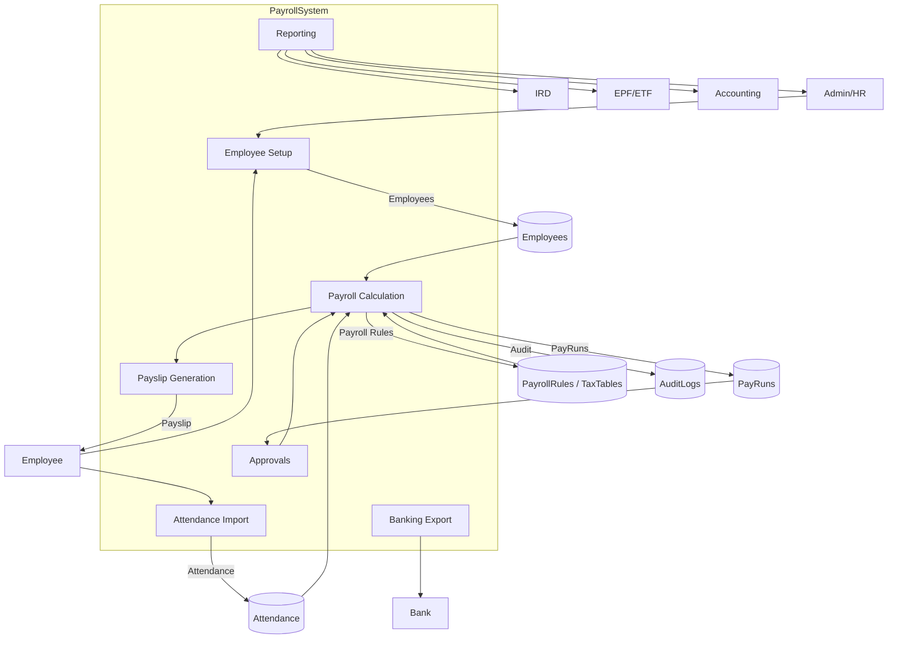
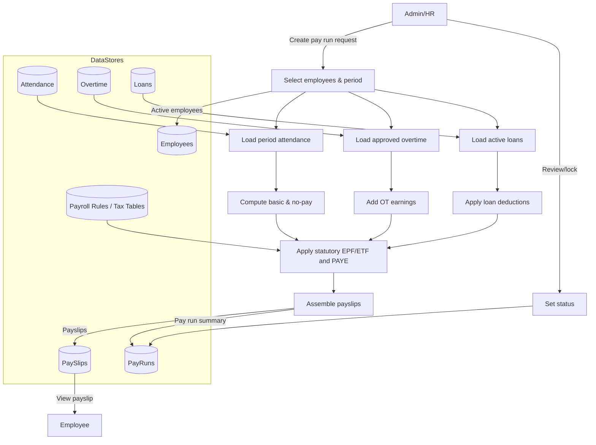

# As-Is Payroll Data Flow and Data Dictionary

## Core payroll entities / tables
- **Employee** – master data with personal details, status flags, and base salary used as the default earning for payroll.【F:backend/Payroll.Domain/Employees/Employee.cs†L6-L167】
- **AttendanceRecord** – hours worked for an employee within a date range; used to compute no-pay deductions.【F:backend/Payroll.Domain/Attendance/AttendanceRecord.cs†L6-L10】
- **PayRun** – payroll batch with period, pay date, status, and generated payslips.【F:backend/Payroll.Domain/Payroll/PayRun.cs†L6-L25】
- **PaySlip** – per-employee payroll result with earnings, deductions, net pay, and statutory amounts.【F:backend/Payroll.Domain/Payroll/PaySlip.cs†L6-L22】
- **EarningLine / DeductionLine** – itemized earnings and deductions attached to a payslip (e.g., basic pay, OT, no-pay, tax).【F:backend/Payroll.Domain/Payroll/EarningLine.cs†L1-L12】【F:backend/Payroll.Domain/Payroll/DeductionLine.cs†L1-L11】
- **OvertimeRecord** – approved overtime hours by type; pulled into payslip earnings when unlocked for payroll.【F:backend/Payroll.Domain/Overtime/OvertimeRecord.cs†L6-L19】
- **Loan / LoanRepayment** – employee loan schedule and installments, reduced during payroll runs.【F:backend/Payroll.Domain/Loans/Loan.cs†L6-L15】【F:backend/Payroll.Domain/Loans/LoanRepayment.cs†L1-L12】
- **AllowanceType / DeductionType** – catalog of recurring earning/deduction definitions with EPF/ETF/tax flags (configuration).【F:backend/Payroll.Domain/PayrollConfig/AllowanceType.cs†L6-L15】【F:backend/Payroll.Domain/PayrollConfig/DeductionType.cs†L6-L14】
- **TaxRuleSet / TaxSlab** – PAYE tax tables with effective dates and rate slabs.【F:backend/Payroll.Domain/PayrollConfig/TaxRuleSet.cs†L6-L14】【F:backend/Payroll.Domain/PayrollConfig/TaxSlab.cs†L6-L13】
- **EpfEtfRuleSet** – statutory EPF/ETF rates, thresholds, and effective dates.【F:backend/Payroll.Domain/PayrollConfig/EpfEtfRuleSet.cs†L6-L17】
- **LeaveRequest** – captures leave type, dates, approval status; currently not integrated into payroll calculations.【F:backend/Payroll.Domain/Leave/LeaveRequest.cs†L6-L22】
- **Shift** – shift definition (start/end times) referenced by attendance but not yet linked in payroll math.【F:backend/Payroll.Domain/Attendance/Shift.cs†L1-L7】

## Key as-is flows
- **Employee onboarding** – HR creates or updates employees (code, base salary, dates).【F:backend/Payroll.Application/Services/EmployeeService.cs†L21-L137】
- **Attendance & overtime capture** – attendance records and approved overtime entries are stored and later filtered by pay period during pay-run generation.【F:backend/Payroll.Application/Services/PayrollService.cs†L167-L189】
- **Payroll run** – admin triggers pay-run creation for a period; system selects employees, gathers attendance/OT/loans, and generates payslips with EPF/ETF and PAYE applied.【F:backend/Payroll.Application/Services/PayrollService.cs†L37-L221】【F:backend/Payroll.Application/Services/PayrollService.cs†L224-L592】
- **Payslip retrieval** – payslips (with earnings/deductions breakdown) can be queried per pay-run.【F:backend/Payroll.Application/Services/PayrollService.cs†L156-L165】【F:backend/Payroll.Application/Services/PayrollService.cs†L551-L572】
- **Status changes** – pay-runs can be recalculated, locked when posted, and queried with pagination.【F:backend/Payroll.Application/Services/PayrollService.cs†L71-L155】

## Missing or partial areas
- **Recurring allowances/deductions** – placeholders exist but the earning/deduction load is TODO, so no catalog-driven recurring components are applied yet.【F:backend/Payroll.Application/Services/PayrollService.cs†L242-L306】
- **Approvals & audit** – pay-run approval is a status flag only; no workflow, approver tracking, or audit log store is implemented.【F:backend/Payroll.Application/Services/PayrollService.cs†L103-L115】【F:backend/Payroll.Infrastructure/Persistence/PayrollDbContext.cs†L18-L33】
- **Reporting** – statutory or financial reports are stubbed without output generation.【F:backend/Payroll.Application/Services/ReportService.cs†L1-L11】
- **Leave impact on payroll** – leave balances and statuses are stored but not factored into earnings/deductions; absences are inferred only from zero-hours attendance entries.【F:backend/Payroll.Domain/Leave/LeaveRequest.cs†L6-L22】【F:backend/Payroll.Application/Services/PayrollService.cs†L285-L305】
- **Banking/export** – no bank file/export integration in the current codebase.
- **General ledger integration** – no accounting postings are produced from pay-runs.
- **Audit logging** – entities inherit audit fields, but no centralized audit log store is configured beyond created/modified metadata.【F:backend/Payroll.Domain/Common/AuditableEntity.cs†L1-L23】

## As-is DFD (Level 0)

## As-is DFD (Level 1 – Payroll run)

## Data dictionary (as-is)
| Table / Aggregate | Columns | Description | Relationships |
| --- | --- | --- | --- |
| Employees | `Id`, `EmployeeCode`, `FirstName`, `LastName`, `Initials`, `CallingName`, `NicNumber`, `DateOfBirth`, `Gender`, `MaritalStatus`, `EmploymentStartDate`, `ProbationEndDate`, `ConfirmationDate`, `BaseSalary`, `CreatedAt`, `CreatedBy`, `ModifiedAt`, `ModifiedBy`, `IsActive` | Master data including personal details, employment dates, and `BaseSalary`. | Referenced by PaySlips, AttendanceRecords, LeaveRequests, OvertimeRecords, and Loans. 【F:backend/Payroll.Domain/Employees/Employee.cs†L6-L118】【F:backend/Payroll.Domain/Common/AuditableEntity.cs†L1-L10】|
| AttendanceRecords | `Id`, `EmployeeId`, `Period.Start`, `Period.End`, `HoursWorked`, `CreatedAt`, `CreatedBy`, `ModifiedAt`, `ModifiedBy`, `IsActive` | Captures work hours per period; used for no-pay calculation. | Links to Employees via `EmployeeId`. 【F:backend/Payroll.Domain/Attendance/AttendanceRecord.cs†L6-L11】【F:backend/Payroll.Domain/Common/AuditableEntity.cs†L1-L10】|
| LeaveRequests | `Id`, `EmployeeId`, `LeaveType`, `StartDate`, `EndDate`, `TotalDays`, `Reason`, `Status`, `ApprovedById`, `RequestedAt`, `ApprovedAt`, `IsHalfDay`, `HalfDaySession`, `CreatedAt`, `CreatedBy`, `ModifiedAt`, `ModifiedBy`, `IsActive` | Leave applications with approval metadata; not yet integrated into payroll amounts. | Links to Employees; approvals tracked via `ApprovedById`. 【F:backend/Payroll.Domain/Leave/LeaveRequest.cs†L6-L23】【F:backend/Payroll.Domain/Common/AuditableEntity.cs†L1-L10】|
| OvertimeRecords | `Id`, `EmployeeId`, `Date`, `Hours`, `Type`, `Status`, `Reason`, `ApprovedById`, `ApprovedAt`, `IsLockedForPayroll`, `CreatedAt`, `CreatedBy`, `ModifiedAt`, `ModifiedBy`, `IsActive` | Approved overtime entries feeding payslip earnings. | Links to Employees; filtered by pay period when generating payslips. 【F:backend/Payroll.Domain/Overtime/OvertimeRecord.cs†L6-L19】【F:backend/Payroll.Domain/Common/AuditableEntity.cs†L1-L10】|
| Loans | `Id`, `EmployeeId`, `PrincipalAmount`, `OutstandingPrincipal`, `InstallmentAmount`, `StartDate`, `EndDate`, `Status`, `CreatedAt`, `CreatedBy`, `ModifiedAt`, `ModifiedBy`, `IsActive` | Employee loans with repayment schedule. | Has many LoanRepayments; referenced when applying deductions. 【F:backend/Payroll.Domain/Loans/Loan.cs†L6-L15】【F:backend/Payroll.Domain/Common/AuditableEntity.cs†L1-L10】|
| LoanRepayments | `Id`, `LoanId`, `DueDate`, `Amount`, `IsPaid` | Planned installments for a loan. | Belongs to Loan via `LoanId`. 【F:backend/Payroll.Domain/Loans/LoanRepayment.cs†L1-L12】|
| PayRuns | `Id`, `Code`, `Name`, `PeriodType`, `Reference`, `PeriodStart`, `PeriodEnd`, `PayDate`, `IsLocked`, `Status`, `CreatedAt`, `CreatedBy`, `ModifiedAt`, `ModifiedBy`, `IsActive` | Payroll batch header for a set of payslips. | Contains many PaySlips. 【F:backend/Payroll.Domain/Payroll/PayRun.cs†L6-L22】【F:backend/Payroll.Domain/Common/AuditableEntity.cs†L1-L10】|
| PaySlips | `Id`, `PayRunId`, `EmployeeId`, `BasicSalary`, `TotalEarnings`, `TotalDeductions`, `NetPay`, `EmployeeEpf`, `EmployerEpf`, `EmployerEtf`, `PayeTax`, `CreatedAt`, `CreatedBy`, `ModifiedAt`, `ModifiedBy`, `IsActive` | Payroll result per employee with earnings/deductions collections. | Belongs to PayRun and Employee; has many EarningLines and DeductionLines. 【F:backend/Payroll.Domain/Payroll/PaySlip.cs†L6-L22】【F:backend/Payroll.Domain/Common/AuditableEntity.cs†L1-L10】|
| EarningLines | `Id`, `PaySlipId`, `Code`, `Description`, `Amount`, `IsEpfApplicable`, `IsEtfApplicable`, `IsTaxable` | Itemized earnings (basic pay, OT, allowances). | Belongs to PaySlip; included in taxable/EPF/ETF bases. 【F:backend/Payroll.Domain/Payroll/EarningLine.cs†L1-L12】|
| DeductionLines | `Id`, `PaySlipId`, `Code`, `Description`, `Amount`, `IsPreTax`, `IsPostTax` | Itemized deductions (no-pay, loans, PAYE, EPF). | Belongs to PaySlip; pre/post-tax flags drive calculations. 【F:backend/Payroll.Domain/Payroll/DeductionLine.cs†L1-L11】|
| AllowanceTypes | `Id`, `Code`, `Name`, `Description`, `Basis`, `IsEpfApplicable`, `IsEtfApplicable`, `IsTaxable`, `CreatedAt`, `CreatedBy`, `ModifiedAt`, `ModifiedBy`, `IsActive` | Catalog of allowance definitions (recurring earnings). | Used for configuration; not yet linked to payslip generation. 【F:backend/Payroll.Domain/PayrollConfig/AllowanceType.cs†L6-L15】【F:backend/Payroll.Domain/Common/AuditableEntity.cs†L1-L10】|
| DeductionTypes | `Id`, `Code`, `Name`, `Description`, `Basis`, `IsPreTax`, `IsPostTax`, `CreatedAt`, `CreatedBy`, `ModifiedAt`, `ModifiedBy`, `IsActive` | Catalog of deduction definitions (recurring deductions). | Used for configuration; not yet linked to payslip generation. 【F:backend/Payroll.Domain/PayrollConfig/DeductionType.cs†L6-L14】【F:backend/Payroll.Domain/Common/AuditableEntity.cs†L1-L10】|
| EpfEtfRuleSets | `Id`, `Name`, `EffectiveFrom`, `EffectiveTo`, `EmployeeEpfRate`, `EmployerEpfRate`, `EmployerEtfRate`, `MinimumWageForEpf`, `MaximumEarningForEpf`, `MaximumEarningForEtf`, `IsDefault`, `CreatedAt`, `CreatedBy`, `ModifiedAt`, `ModifiedBy`, `IsActive` | Statutory contribution rules applied during payroll. | Used when computing EPF/ETF bases and amounts. 【F:backend/Payroll.Domain/PayrollConfig/EpfEtfRuleSet.cs†L6-L18】【F:backend/Payroll.Domain/Common/AuditableEntity.cs†L1-L10】|
| TaxRuleSets | `Id`, `Name`, `YearOfAssessment`, `EffectiveFrom`, `EffectiveTo`, `IsDefault`, `CreatedAt`, `CreatedBy`, `ModifiedAt`, `ModifiedBy`, `IsActive` | PAYE rule header with effective period. | Has many TaxSlabs; selected per pay date. 【F:backend/Payroll.Domain/PayrollConfig/TaxRuleSet.cs†L6-L15】【F:backend/Payroll.Domain/Common/AuditableEntity.cs†L1-L10】|
| TaxSlabs | `Id`, `TaxRuleSetId`, `FromAmount`, `ToAmount`, `RatePercent`, `Order`, `CreatedAt`, `CreatedBy`, `ModifiedAt`, `ModifiedBy`, `IsActive` | Defines progressive tax brackets. | Belongs to TaxRuleSet; iterated to compute PAYE. 【F:backend/Payroll.Domain/PayrollConfig/TaxSlab.cs†L6-L13】【F:backend/Payroll.Domain/Common/AuditableEntity.cs†L1-L10】|
| Audit (implicit) | `Id`, `CreatedAt`, `CreatedBy`, `ModifiedAt`, `ModifiedBy`, `IsActive` | Audit metadata inherited by most aggregates. | Present on `AuditableEntity` descendants; no centralized log. 【F:backend/Payroll.Domain/Common/AuditableEntity.cs†L1-L10】【F:backend/Payroll.Domain/Common/EntityBase.cs†L1-L6】|
