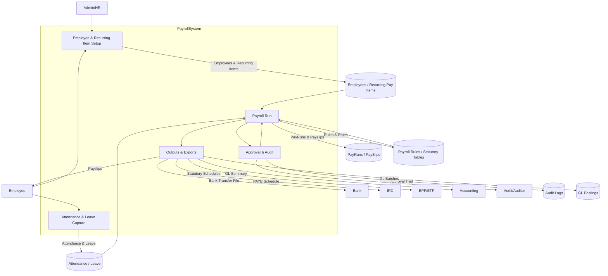

# To-Be Payroll Data Flow Diagrams

## To-Be DFD (Level 0)


## To-Be DFD (Level 1 – Payroll Run)
```mermaid
graph TD
    HR[Admin/HR]
    Emp[Employee]

    subgraph DataStores
      D1[(Employee Master & Recurring Items)]
      D2[(Attendance & OT)]
      D3[(Leave Adjustments)]
      D4[(Loans / Advances)]
      D5[(Payroll Rules & Statutory Tables)]
      D6[(PayRuns)]
      D7[(PaySlips)]
      D8[(Audit Trail)]
      D9[(GL Posting Staging)]
    end

    HR -->|Initiate pay period| PR1[Select employees & period]
    PR1 -->|Load master| D1
    PR1 --> PR2[Load attendance & OT]
    D2 --> PR2
    PR1 --> PR3[Load leave adjustments]
    D3 --> PR3
    PR1 --> PR4[Load loans & advances]
    D4 --> PR4

    PR2 --> PR5[Build earnings & deductions]
    PR3 --> PR5
    PR4 --> PR6[Apply one-offs (loans/advances)]
    PR5 --> PR7[Statutory EPF/ETF calculation]
    PR5 --> PR8[PAYE calculation using slabs]
    D5 --> PR7
    D5 --> PR8

    PR7 --> PR9[Assemble payroll results]
    PR8 --> PR9
    PR6 --> PR9
    PR9 -->|Draft payslips| D7
    PR9 -->|Draft pay run| D6

    HR -->|Review| PR10[Review → Approve → Lock]
    PR10 --> D6
    PR10 --> D8
    PR9 --> PR10

    PR10 --> PR11[Generate outputs]
    PR11 -->|Payslips| Emp
    PR11 -->|Statutory Schedules (EPF/ETF)| EPF[EPF/ETF]
    PR11 -->|PAYE Schedule| IRD[IRD]
    PR11 -->|Bank export file| Bank[Bank]
    PR11 -->|GL summary/posting| D9
    D9 --> ACC[Accounting]
```
